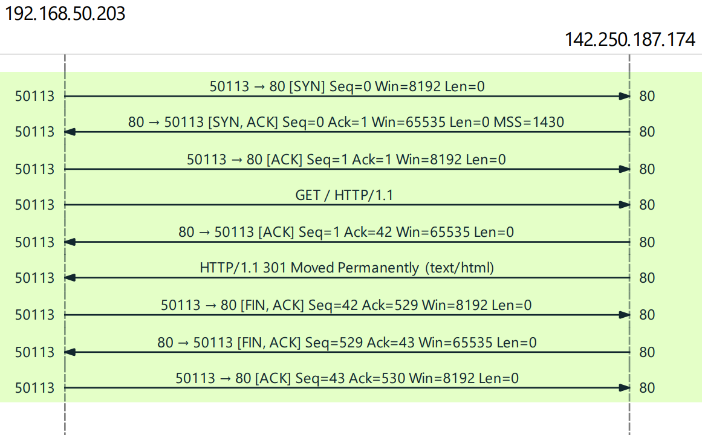
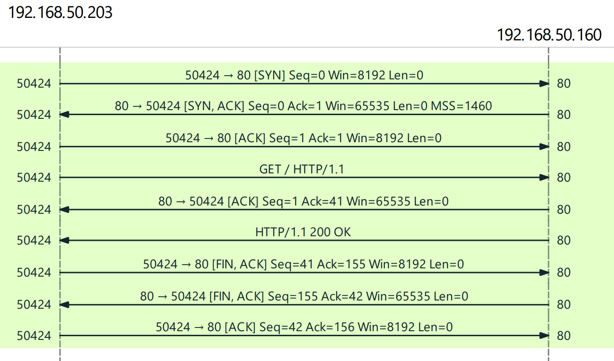

# Http Client

This is an example to show how to create HTTP's GET request with constructing and capturing network packets using the `Pcap.Net` library for `WinPcap` available devices. Created for educational purposes.

[COAP like protocol](../../tree/coap-like-protocol) is also available as a branch.

[UDP messaging example](../../tree/udp-messaging) is also available as a branch.

[DNS Lookup example](../../tree/my-nslookup) is also available as a branch.

Implementation contains 3 main proceses; 
- Establishing a proper TCP connection with creating 3-Way Handshake and getting Ephemeral port from operating system's kernel.
- Sending HTTP requests and waiting their responses over the TCP connection with the correct Sequence and Acknowledgement numbers.
- Termination of the TCP connection.

https://user-images.githubusercontent.com/1637572/172645464-31f4a71f-b21c-4310-8388-274fa3553186.mp4

## Build

```
dotnet restore
dotnet build
```

## Run

Running with User Interaction mode. You will be asked for network interface selection and destination(ip or hostname) in this mode.
```
.\http-client.exe
```
Running with Destination Provisioning mode. You will be asked only for network interface selection.

```
.\http-client.exe <ip or hostname>
```

Running with Provisioning mode. You will not be asked for anything.

```
.\http-client.exe <interface id> <ip or hostname>
```

## Examples

### Request 1

More resources about this request can be found in [here](examples/request1/)



```
> http-client.exe 0 google.com
Internet 192.168.50.203
Source IP: 192.168.50.203
Source MAC: 0A:99:7C:15:7C:1B
Destination MAC: 96:7F:DB:82:F0:16
Destination IP: 142.250.187.174
Host: google.com


HTTP/1.1 301 Moved Permanently
Location: http://www.google.com/
Content-Type: text/html; charset=UTF-8
Date: Tue, 07 Jun 2022 21:32:58 GMT
Expires: Thu, 07 Jul 2022 21:32:58 GMT
Cache-Control: public, max-age=2592000
Server: gws
Content-Length: 219
X-XSS-Protection: 0
X-Frame-Options: SAMEORIGIN

<HTML><HEAD><meta http-equiv="content-type" content="text/html;charset=utf-8">
<TITLE>301 Moved</TITLE></HEAD><BODY>
<H1>301 Moved</H1>
The document has moved
<A HREF="http://www.google.com/">here</A>.
</BODY></HTML>
```

### Request 2

More resources about this request can be found in [here](examples/request2/)



```
> http-client.exe 0 192.168.50.160
Internet 192.168.50.203
Source IP: 192.168.50.203
Source MAC: 0A:99:7C:15:7C:1B
Destination MAC: 96:7F:DB:82:F0:16
Destination IP: 192.168.50.160


HTTP/1.1 200 OK
Date: Tue, 07 Jun 2022 21:51:34 GMT
Connection: keep-alive
Keep-Alive: timeout=5
Transfer-Encoding: chunked

d
Hello, World!
0
```

## Dependencies

* [MSVC redistributables](https://docs.microsoft.com/en-us/cpp/windows/latest-supported-vc-redist?view=msvc-170)
* [.NET 6.0](https://dotnet.microsoft.com/en-us/download/dotnet/6.0)
* [WinPcap driver](https://www.winpcap.org/).
* [Pcap.Net](https://github.com/PcapDotNet/Pcap.Net) (included with the repo)

## Credits

Code is heavily based on the [Pcap.Net's Wiki page](https://github.com/PcapDotNet/Pcap.Net/wiki).